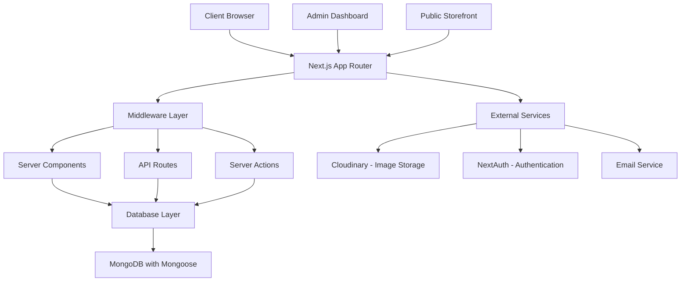

# Design Document

## Overview

This design document outlines the technical architecture for a full-stack e-commerce platform built with Next.js 15.4.3 App Router, featuring a comprehensive admin CMS, user authentication, product management, and order processing. The system will leverage modern web technologies including TypeScript, Tailwind CSS, MongoDB with Mongoose, Cloudinary for media management, and NextAuth for authentication.

## Architecture

### High-Level Architecture



### Technology Stack

- **Frontend**: Next.js 15.4.3 with App Router, React 19, TypeScript
- **Styling**: Tailwind CSS 4.0 with custom components
- **Database**: MongoDB with Mongoose ODM
- **Authentication**: NextAuth.js with Google OAuth
- **File Storage**: Cloudinary for images and media
- **State Management**: React Server Components + Client Components
- **Form Handling**: Server Actions with validation
- **UI Components**: Radix UI primitives with custom styling

## Components and Interfaces

### Core Component Structure

```
app/
├── (admin)/
│   ├── admin/
│   │   ├── dashboard/
│   │   ├── products/
│   │   ├── categories/
│   │   ├── orders/
│   │   ├── users/
│   │   ├── settings/
│   │   └── analytics/
├── (auth)/
│   ├── login/
│   └── register/
├── (shop)/
│   ├── products/
│   ├── categories/
│   ├── cart/
│   └── checkout/
├── (user)/
│   ├── profile/
│   ├── orders/
│   └── wishlist/
├── api/
│   ├── auth/
│   ├── products/
│   ├── orders/
│   ├── upload/
│   └── webhooks/
└── components/
    ├── ui/
    ├── admin/
    ├── shop/
    └── shared/
```

### Key Components

#### Admin Components
- **AdminLayout**: Main admin dashboard layout with sidebar navigation
- **ProductManager**: CRUD interface for product management
- **CategoryManager**: Hierarchical category management with drag-and-drop
- **OrderManager**: Order status tracking and management
- **UserManager**: User role management and permissions
- **MediaUploader**: Cloudinary integration for image uploads
- **RichTextEditor**: TipTap-based editor for product descriptions
- **SEOManager**: Meta data and OpenGraph configuration

#### Public Components
- **HeroSlider**: Swiper-based homepage hero carousel
- **CategoryCarousel**: Horizontal category navigation
- **ProductGrid**: Responsive product listing with filters
- **ProductCard**: Individual product display component
- **ProductDetail**: Full product page with image gallery
- **ShoppingCart**: Cart management and checkout flow
- **OrderTracking**: Customer order status display

#### Shared Components
- **Header**: Navigation with authentication state
- **Footer**: Site links and information
- **LoadingSpinner**: Consistent loading states
- **SkeletonLoader**: Content placeholders during loading
- **Modal**: Reusable modal dialogs
- **Toast**: Notification system

## Data Models

### User Model
```typescript
interface User {
  _id: ObjectId;
  name: string;
  email: string;
  image?: string;
  role: 'customer' | 'editor' | 'manager' | 'super_admin';
  phone?: string;
  address?: {
    street: string;
    city: string;
    state: string;
    zipCode: string;
    country: string;
  };
  wishlist: ObjectId[]; // Product IDs
  createdAt: Date;
  updatedAt: Date;
}
```

### Product Model
```typescript
interface Product {
  _id: ObjectId;
  title: string;
  slug: string;
  description: string;
  shortDescription?: string;
  sku: string;
  basePrice: number;
  images: {
    url: string;
    publicId: string;
    isDefault: boolean;
    order: number;
  }[];
  category: ObjectId;
  subcategory?: ObjectId;
  variations: {
    type: 'size' | 'color' | 'custom';
    name: string;
    options: {
      value: string;
      price: number;
      sku: string;
      stock: number;
    }[];
  }[];
  customFields: {
    [key: string]: string | number | boolean;
  };
  seo: {
    metaTitle?: string;
    metaDescription?: string;
    keywords?: string[];
    ogImage?: string;
  };
  status: 'draft' | 'review' | 'published';
  featured: boolean;
  stock: number;
  lowStockThreshold: number;
  tags: string[];
  notes?: string; // Admin-only internal notes
  publishedAt?: Date;
  scheduledPublishAt?: Date;
  scheduledUnpublishAt?: Date;
  deletedAt?: Date;
  createdBy: ObjectId;
  updatedBy: ObjectId;
  createdAt: Date;
  updatedAt: Date;
}
```

### Category Model
```typescript
interface Category {
  _id: ObjectId;
  name: string;
  slug: string;
  description?: string;
  image?: {
    url: string;
    publicId: string;
  };
  parent?: ObjectId;
  children: ObjectId[];
  customFields: {
    name: string;
    type: 'text' | 'number' | 'boolean' | 'select';
    required: boolean;
    options?: string[]; // For select type
  }[];
  order: number;
  isActive: boolean;
  seo: {
    metaTitle?: string;
    metaDescription?: string;
    keywords?: string[];
  };
  createdAt: Date;
  updatedAt: Date;
}
```

### Order Model
```typescript
interface Order {
  _id: ObjectId;
  orderNumber: string;
  customer: ObjectId;
  items: {
    product: ObjectId;
    variation?: {
      type: string;
      value: string;
    };
    quantity: number;
    price: number;
    total: number;
  }[];
  subtotal: number;
  tax: number;
  shipping: number;
  total: number;
  paymentMethod: 'cash_on_delivery';
  paymentStatus: 'pending' | 'paid' | 'failed';
  shippingAddress: {
    name: string;
    phone: string;
    street: string;
    city: string;
    state: string;
    zipCode: string;
    country: string;
  };
  status: 'pending' | 'confirmed' | 'processing' | 'shipped' | 'delivered' | 'cancelled';
  statusHistory: {
    status: string;
    timestamp: Date;
    updatedBy: ObjectId;
    notes?: string;
  }[];
  trackingNumber?: string;
  notes?: string;
  createdAt: Date;
  updatedAt: Date;
}
```

### Banner/Slider Model
```typescript
interface Banner {
  _id: ObjectId;
  title: string;
  subtitle?: string;
  image: {
    url: string;
    publicId: string;
  };
  link?: {
    url: string;
    type: 'product' | 'category' | 'external';
    target: '_self' | '_blank';
  };
  order: number;
  isActive: boolean;
  startDate?: Date;
  endDate?: Date;
  createdAt: Date;
  updatedAt: Date;
}
```

### Settings Model
```typescript
interface Settings {
  _id: ObjectId;
  key: string;
  value: any;
  type: 'string' | 'number' | 'boolean' | 'object' | 'array';
  category: 'general' | 'seo' | 'email' | 'social' | 'shipping';
  updatedBy: ObjectId;
  updatedAt: Date;
}
```

### Audit Log Model
```typescript
interface AuditLog {
  _id: ObjectId;
  user: ObjectId;
  action: string;
  resource: string;
  resourceId: ObjectId;
  changes?: {
    field: string;
    oldValue: any;
    newValue: any;
  }[];
  ipAddress: string;
  userAgent: string;
  timestamp: Date;
}
```

## Error Handling

### Error Boundaries
- **Global Error Boundary**: Catches unhandled errors and displays fallback UI
- **Route-specific Error Pages**: Custom 404, 500, and other HTTP error pages
- **Form Validation Errors**: Client and server-side validation with user-friendly messages
- **API Error Handling**: Consistent error response format across all endpoints

### Error Response Format
```typescript
interface ErrorResponse {
  success: false;
  error: {
    code: string;
    message: string;
    details?: any;
  };
  timestamp: string;
}
```

## Testing Strategy

### Unit Testing
- **Components**: Test individual React components with React Testing Library
- **Utilities**: Test helper functions and custom hooks
- **API Routes**: Test server-side logic and database operations
- **Server Actions**: Test form submissions and data mutations

### Integration Testing
- **Authentication Flow**: Test login, logout, and protected routes
- **E-commerce Flow**: Test product browsing, cart, and checkout process
- **Admin Operations**: Test CRUD operations for products, categories, and orders
- **File Upload**: Test Cloudinary integration and image handling

### End-to-End Testing
- **User Journeys**: Test complete user workflows from registration to order completion
- **Admin Workflows**: Test admin dashboard operations and content management
- **Cross-browser Testing**: Ensure compatibility across different browsers and devices
- **Performance Testing**: Test loading times and responsiveness under load

### Testing Tools
- **Jest**: Unit testing framework
- **React Testing Library**: Component testing
- **Playwright**: End-to-end testing
- **MSW (Mock Service Worker)**: API mocking for tests

## Security Considerations

### Authentication & Authorization
- **NextAuth.js**: Secure session management with JWT tokens
- **Role-based Access Control**: Middleware-based route protection
- **CSRF Protection**: Built-in Next.js CSRF protection
- **Rate Limiting**: API route protection against abuse

### Data Security
- **Input Validation**: Server-side validation for all user inputs
- **SQL Injection Prevention**: Mongoose ODM provides built-in protection
- **XSS Prevention**: React's built-in XSS protection + content sanitization
- **File Upload Security**: Cloudinary handles file validation and processing

### Environment Security
- **Environment Variables**: Secure storage of API keys and secrets
- **HTTPS Enforcement**: SSL/TLS encryption for all communications
- **Content Security Policy**: Headers to prevent XSS and injection attacks
- **Database Security**: MongoDB connection with authentication and encryption

## Performance Optimization

### Frontend Optimization
- **Server Components**: Reduce client-side JavaScript bundle
- **Image Optimization**: Next.js Image component with Cloudinary transformations
- **Code Splitting**: Automatic route-based code splitting
- **Caching**: Static generation for product pages and categories
- **Lazy Loading**: Components and images loaded on demand

### Backend Optimization
- **Database Indexing**: Optimized MongoDB indexes for common queries
- **Query Optimization**: Efficient Mongoose queries with population
- **Caching Strategy**: Redis caching for frequently accessed data
- **CDN Integration**: Cloudinary CDN for global image delivery

### Monitoring & Analytics
- **Performance Monitoring**: Core Web Vitals tracking
- **Error Tracking**: Comprehensive error logging and monitoring
- **User Analytics**: Admin dashboard with sales and user metrics
- **Database Monitoring**: Query performance and optimization insights